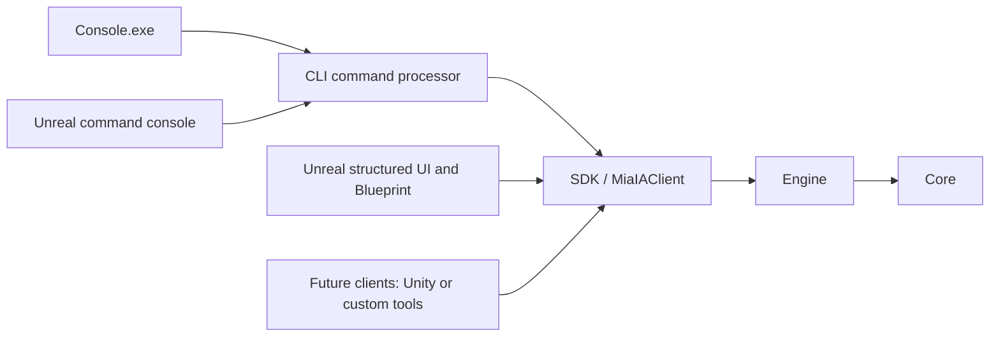

# MiaIA Architecture

## Purpose

MiaIA separates an understandable, client-facing representation of a neural network from the mathematical operations that execute and analyze it. The design follows the same broad principle used by graphics engines: high-level objects describe what exists, while specialized engine subsystems perform editing, validation, execution, interchange, and analysis.

The architecture is intended to support multiple front ends. Unreal Engine is the first graphical client, but it is not the owner of the neural-network engine.

## Dependency direction



Dependencies move inward. Core does not depend on Engine, SDK, Console, or Unreal. Engine does not depend on a client. Clients should not bypass the SDK facade.

## Modules

### Core

Core contains the stable representation of data:

- `Network`, `Layer`, `Neuron`, and `Connection`;
- `Dataset` and `Sample`;
- activation primitives;
- public snapshots for network inspection, datasets, evaluations, and gradients.

Core structures describe state. They do not import files, run training commands, or manage a user interface.

### Engine

Engine owns operations and mathematical behavior. Its current responsibilities are divided into focused subsystems:

| Subsystem | Responsibility |
| --- | --- |
| `Editing` | Add and remove layers, neurons, and connections |
| `Topology` | Resolve network elements and their relationships |
| `Parameters` | Update biases and activation functions |
| `Weights` | Read and update connection weights |
| `Input` | Validate and assign input activations |
| `Inference` | Execute direct input-to-output prediction |
| `Validation` | Verify that a network can be executed safely |
| `Execution` | Perform forward propagation |
| `Runtime` | Create networks and expose runtime operations |
| `Inspection` | Build read-only network snapshots |
| `Interchange` | Import and export the supported ONNX subset |
| `Data` | Import, inspect, and apply CSV dataset samples |
| `Evaluation` | Calculate predictions, errors, loss, and loss derivatives |
| `Differentiation` | Run backward propagation and produce gradient snapshots |
| `Optimization` | Validate and apply explicit optimizer updates |
| `Training` | Coordinate phased, atomic, epoch, and session training flows |

This separation allows a mathematical subsystem to evolve without requiring client code to manipulate its internal data structures directly.

### SDK

`MiaIAClient` is the public facade used by clients. It exposes network creation and editing, snapshots, ONNX interchange, datasets, forward execution, sample and full-dataset evaluation, gradient evaluation, atomic sample training, and an ordered dataset epoch.

The current SDK owns one process-local network and one process-local dataset through its internal client state. This is sufficient for the present console and integration tests. Multiple sessions, explicit contexts, concurrency, and persisted workspace state are future concerns and should not be assumed to exist today.

### CLI command processor

The CLI module is a reusable static library that parses one textual command and dispatches it through `MiaIAClient`. It returns captured command output and an explicit exit request instead of owning a terminal loop. Relative file paths are resolved against a working directory supplied by the host.

The module also owns the structured command catalog used for contextual discovery. A client supplies the partially entered text and receives bounded suggestions containing a completion, complete syntax, and short description. Command paths are filtered one level at a time, while an active parameter sequence retains the complete syntax as guidance. This keeps command knowledge out of Unreal-specific widgets and makes the same catalog available to future clients.

`Console.exe` and the Unreal editor console use this same processor in the same process as their SDK state. Unreal does not launch `Console.exe`: a separate process would own a separate process-local network, dataset, and training session. Command execution is serialized because the current processor captures the existing command handlers' standard output during dispatch.

### Clients

`Console.exe` is a thin terminal host around the shared CLI command processor. It is both a usable diagnostic client and a reference for other integrations.

The Unreal Engine project is the first graphical integration. Its runtime Blueprint function library converts native session, phase, neuron, and connection snapshots into Unreal-reflected types while keeping every operation behind `MiaIAClient`. It also exposes the shared command processor to Blueprint and to the editor panel. It provides the first end-to-end Blueprint debug flow, but it is not yet the complete MiaIA editor experience.

## Network representation

A network contains ordered layers. Layer order starts at zero and must be contiguous for forward execution. Order zero is the input layer. Connections must point from an earlier layer to a later layer. Every non-input neuron must have at least one incoming connection.

The dense network factory currently creates:

- one input layer;
- zero or more hidden layers of equal width;
- one output layer;
- fully connected transitions;
- initial connection weights of `0.1`;
- initial biases and activations of `0.0`;
- Sigmoid as the default activation for created non-input layers.

Dense creation is a transactional batch operation. The factory calculates neuron and connection counts with checked arithmetic, reserves the required storage, constructs the graph directly, validates it once, and only then replaces the public network. The atomic `NetworkEditor` methods retain their stricter per-operation checks for interactive edits; repeatedly calling them is intentionally not the implementation path for generated dense graphs.

For `I` inputs, hidden width `H`, `L` hidden layers, and `O` outputs, the neuron count is `I + L*H + O`. With at least one hidden layer, the connection count is `I*H + (L-1)*H*H + H*O`; without hidden layers it is `I*O`.

`NetworkSnapshot` contains every neuron and connection. `NetworkOverviewSnapshot` is the lightweight inspection boundary for clients that first need layer metadata and aggregate counts before deciding whether a complete graph copy is appropriate.

Supported activation functions are Sigmoid, ReLU, Tanh, and Linear.

## Runtime data flows

### Forward propagation

```text
Input values
    -> NetworkInput validation
    -> NetworkValidator
    -> ForwardEngine
    -> updated neuron activations
    -> NetworkSnapshot
```

For each non-input neuron, forward propagation computes the weighted sum of incoming activations plus the neuron bias, then applies the layer activation function.

### Prediction

```text
Input vector
    -> validate network and input dimensions
    -> assign input activations
    -> forward propagation
    -> collect activations from the highest-order layer
    -> PredictionSnapshot
```

Prediction is the target-free inference path. Unlike sample evaluation, it does not require a dataset or expected outputs. A successful prediction leaves the calculated activations available for inspection. Validation failures preserve the previous activations and caller result; unexpected non-finite outputs trigger activation restoration.

### Sample evaluation

```text
Dataset sample
    -> validate input and target dimensions
    -> apply sample inputs
    -> forward propagation
    -> collect output activations as predictions
    -> compare predictions with targets
    -> SampleEvaluationSnapshot
```

The first implemented loss is mean squared error. Evaluation changes neuron activations because it performs a forward pass. It does not change weights or biases.

### Fixed-model dataset evaluation

```text
Copy current network
    -> evaluate every dataset sample on the copy
    -> retain each SampleEvaluationSnapshot
    -> calculate the mean of all sample losses
    -> publish DatasetEvaluationSnapshot after complete success
```

The copied network isolates temporary forward activations from public state. All samples use the same weights and biases, so `MeanLoss` is a fixed-model metric suitable for comparison before and after training. If any sample fails, neither the public network nor the caller-provided result changes.

### Gradient evaluation

```text
Sample evaluation
    -> derivative of loss with respect to predictions
    -> backward propagation through activation functions
    -> weight and bias derivatives
    -> SampleGradientSnapshot
```

Backward propagation currently calculates gradients only. It deliberately does not apply them. This keeps observation separate from optimization and makes gradients available to Console, Unreal, Blueprint wrappers, and future debugging tools.

### Atomic SGD training step

```text
Copy current network
    -> evaluate sample and calculate gradients on the copy
    -> validate every proposed SGD weight and bias update
    -> apply updates to the copy
    -> evaluate the same sample again
    -> publish before/after TrainingStepSnapshot
    -> replace the current network only after complete success
```

Stochastic gradient descent applies `parameter - learningRate * gradient`. Input-layer biases are not trainable parameters in the current feed-forward model and are not updated. Copying the candidate network prioritizes transactional correctness in this foundation implementation; a future training-session design may replace the copy with a versioned parameter transaction after equivalent guarantees are tested.

### Atomic dataset epoch

```text
Copy current network
    -> visit dataset samples in CSV order
    -> execute one atomic TrainingStepExecutor operation per sample
    -> retain every TrainingStepSnapshot
    -> calculate running before/after loss means
    -> publish TrainingEpochSnapshot and candidate network after complete success
```

An epoch currently means exactly one ordered pass over the loaded dataset using single-sample SGD. The entire epoch is transactional at the public network boundary: if any sample fails, the original network and the caller-provided result remain unchanged.

`MeanLossBeforeUpdate` is the mean of each sample's loss immediately before that sample's update. `MeanLossAfterUpdate` is the mean immediately after each update. Because the network changes between samples, these values are execution-trace summaries; they are not full-dataset evaluations of one fixed pre-epoch and post-epoch model.

### Controlled training session

```text
Start session with epoch count and optimizer configuration
    -> remain paused before the first sample
    -> next: execute one atomic TrainingStepExecutor operation
    -> publish the updated network and append the step history
    -> advance sample and epoch cursors
    -> remain paused before the following sample
```

A session starts Active at a safe step boundary. `next` executes exactly one sample, while bounded runs compose multiple steps synchronously. Clients can inspect snapshots or intentionally edit compatible network parameters while the session is Active. Dataset size and network compatibility are checked again before every advance. A rejected step preserves the network, session cursor, history, and caller result.

`resume` changes an Active session to Running and launches one SDK-owned background worker. `pause` requests cooperative stop, waits for the current atomic sample step to finish, joins the worker, and returns the session to Active. The network is therefore never exposed halfway through an update. Completion occurs after the configured number of ordered epochs. Cancellation stops and joins a running worker but does not roll back successful steps.

All SDK access to the process-local network, dataset, and session is serialized by one client-state mutex. Snapshot and inspection calls remain available while Running and observe a coherent step boundary. Operations that would mutate the network, dataset, or activations are rejected until the session is paused. Worker stop reasons distinguish a requested pause, requested cancellation, and a failed step.

A bounded run composes repeated `next` operations synchronously. It can stop because its requested step limit was reached, the session completed, or a step failed. Unlike the separately atomic `train epoch` operation, a session run is progressive: successful steps remain published if a later step fails. The session stays Active at the failed sample so a client can inspect state, intervene, retry, or cancel. `TrainingRunSnapshot` contains the start/end cursors, executed steps, trace means, detailed step snapshots, and an explicit stop reason.

`TrainingSessionInspector` provides two read-only views over retained steps. History entries are lightweight indexes containing epoch, sample, loss transition, and update counts. Detailed lookup returns the original `TrainingStepSnapshot`, including evaluation, gradients, and every parameter update. Both operations use the SDK state lock and are safe at a coherent boundary while background training is Running.

`TrainingDebugController` is the transaction boundary for a single inspectable SGD step. It owns a private candidate copy and advances through `BeforeForward`, `ForwardComplete`, `BackwardComplete`, `UpdateComplete`, `Verified`, and `Committed`. Phase snapshots include the candidate network and all calculations available at that point. The public network is assigned only at commit, while cancellation destroys the candidate. `TrainingStepExecutor` runs this same controller to completion, so atomic and interactive execution share one mathematical implementation.

`TrainingDebugInspector` provides focused read-only views of a neuron or connection without requiring a client to search the complete debug snapshot. Each result compares public and candidate values and exposes phase-dependent gradients and updates with explicit availability flags. This is the intended query boundary for Console selection, Unreal navigation, and future Blueprint nodes.

`TrainingSessionDebugController` attaches the same phase transaction to the session's current cursor and configuration. The session remains unchanged until candidate commit. A shared `TrainingSessionController::RecordStep` operation then records both ordinary and debugged steps, enforcing the expected sample and history position before advancing the cursor. SDK guards prevent synchronous or background session execution while an attached transaction is active.

## Snapshot boundary

Clients receive snapshots rather than references to mutable engine storage. A snapshot is a value object suitable for inspection, display, logging, comparison, or transport across an integration boundary.

Current public snapshots include:

- network, layer, neuron, and connection state;
- dataset summary and individual samples;
- predictions, targets, errors, sample loss, and fixed-model dataset mean loss;
- activation, pre-activation, bias, and weight gradients;
- individual SGD parameter updates and ordered epoch step histories;
- controlled session configuration, progress, status, and complete step history;
- bounded run progress, trace means, details, and stop reason;
- background worker state and stop reason.
- lightweight training-history entries and complete retained steps.

This boundary is important for future graphical debugging: visual components can consume a stable description without becoming owners of engine internals.

## Data interchange

### ONNX

ONNX is the external model interchange format. The current exporter writes opset 18 models for supported feed-forward dense networks using `Gemm` nodes and optional Sigmoid, Relu, or Tanh activation nodes. Linear layers require no separate activation node.

The importer intentionally supports the corresponding dense feed-forward subset rather than every ONNX operator and graph shape. Unsupported graphs fail without replacing the current network.

### CSV datasets

CSV is the current sample interchange format. The caller explicitly supplies `N` input columns and `M` target columns. Each row must contain exactly `N + M` finite numeric values. The first `N` values become inputs and the following `M` values become targets.

CSV contains samples, not MiaIA editor or debug metadata.

### Future `.mia` format

The planned `.mia` format will represent a MiaIA workspace rather than only an inference graph. Candidate data includes visualization layout, annotations, debug state, training checkpoints, history, and editor settings. This format is not implemented yet.

## Validation and failure behavior

Public operations return `bool` when failure is expected and recoverable. Importers and creation operations build validated replacement state before publishing it. Inspection methods return snapshots or use `TryGet...` patterns.

Clients should treat a `false` result as a rejected operation and should not infer a detailed reason unless a diagnostic API explicitly provides one. Rich structured diagnostics are planned work.

## Current constraints

- one process-local network and dataset;
- feed-forward execution only;
- dense factory and a limited ONNX graph subset;
- MSE is the only loss type;
- SGD is the only optimizer;
- background execution uses one cooperative worker and one process-local state lock;
- no mini-batches, checkpoints, breakpoints, or configurable sample ordering yet;
- no `.mia` persistence yet;
- Unreal visualization and Blueprint coverage are incomplete.

These constraints describe the current implementation, not the intended final scope.
