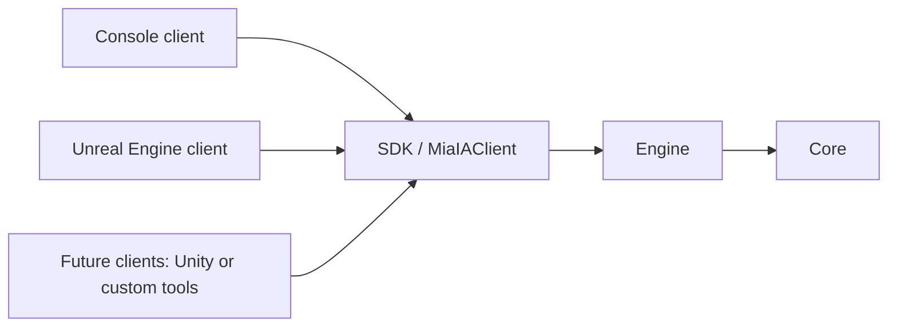

# MiaIA Architecture

## Purpose

MiaIA separates an understandable, client-facing representation of a neural network from the mathematical operations that execute and analyze it. The design follows the same broad principle used by graphics engines: high-level objects describe what exists, while specialized engine subsystems perform editing, validation, execution, interchange, and analysis.

The architecture is intended to support multiple front ends. Unreal Engine is the first graphical client, but it is not the owner of the neural-network engine.

## Dependency direction



Dependencies move inward. Core does not depend on Engine, SDK, Console, or Unreal. Engine does not depend on a client. Clients should not bypass the SDK facade.

## Modules

### Core

Core contains the stable representation of data:

- `Network`, `Layer`, `Neuron`, and `Connection`;
- `Dataset` and `Sample`;
- activation primitives;
- public snapshots for network inspection, datasets, evaluations, and gradients.

Core structures describe state. They do not import files, run training commands, or manage a user interface.

### Engine

Engine owns operations and mathematical behavior. Its current responsibilities are divided into focused subsystems:

| Subsystem | Responsibility |
| --- | --- |
| `Editing` | Add and remove layers, neurons, and connections |
| `Topology` | Resolve network elements and their relationships |
| `Parameters` | Update biases and activation functions |
| `Weights` | Read and update connection weights |
| `Input` | Validate and assign input activations |
| `Validation` | Verify that a network can be executed safely |
| `Execution` | Perform forward propagation |
| `Runtime` | Create networks and expose runtime operations |
| `Inspection` | Build read-only network snapshots |
| `Interchange` | Import and export the supported ONNX subset |
| `Data` | Import, inspect, and apply CSV dataset samples |
| `Evaluation` | Calculate predictions, errors, loss, and loss derivatives |
| `Differentiation` | Run backward propagation and produce gradient snapshots |
| `Optimization` | Validate and apply explicit optimizer updates |
| `Training` | Coordinate an atomic sample training step |

This separation allows a mathematical subsystem to evolve without requiring client code to manipulate its internal data structures directly.

### SDK

`MiaIAClient` is the public facade used by clients. It exposes network creation and editing, snapshots, ONNX interchange, datasets, forward execution, sample evaluation, gradient evaluation, and an atomic sample training step.

The current SDK owns one process-local network and one process-local dataset through its internal client state. This is sufficient for the present console and integration tests. Multiple sessions, explicit contexts, concurrency, and persisted workspace state are future concerns and should not be assumed to exist today.

### Clients

The Console translates text commands into SDK calls. It is both a usable diagnostic client and a reference for other integrations.

The Unreal Engine project is the first graphical integration. Its intended role is to expose SDK operations to C++ and Blueprint, provide an IDE-style command surface, and visualize the state returned by snapshots. The current Unreal work is an initial integration rather than the complete MiaIA editor experience.

## Network representation

A network contains ordered layers. Layer order starts at zero and must be contiguous for forward execution. Order zero is the input layer. Connections must point from an earlier layer to a later layer. Every non-input neuron must have at least one incoming connection.

The dense network factory currently creates:

- one input layer;
- zero or more hidden layers of equal width;
- one output layer;
- fully connected transitions;
- initial connection weights of `0.1`;
- initial biases and activations of `0.0`;
- Sigmoid as the default activation for created non-input layers.

Supported activation functions are Sigmoid, ReLU, Tanh, and Linear.

## Runtime data flows

### Forward propagation

```text
Input values
    -> NetworkInput validation
    -> NetworkValidator
    -> ForwardEngine
    -> updated neuron activations
    -> NetworkSnapshot
```

For each non-input neuron, forward propagation computes the weighted sum of incoming activations plus the neuron bias, then applies the layer activation function.

### Sample evaluation

```text
Dataset sample
    -> validate input and target dimensions
    -> apply sample inputs
    -> forward propagation
    -> collect output activations as predictions
    -> compare predictions with targets
    -> SampleEvaluationSnapshot
```

The first implemented loss is mean squared error. Evaluation changes neuron activations because it performs a forward pass. It does not change weights or biases.

### Gradient evaluation

```text
Sample evaluation
    -> derivative of loss with respect to predictions
    -> backward propagation through activation functions
    -> weight and bias derivatives
    -> SampleGradientSnapshot
```

Backward propagation currently calculates gradients only. It deliberately does not apply them. This keeps observation separate from optimization and makes gradients available to Console, Unreal, Blueprint wrappers, and future debugging tools.

### Atomic SGD training step

```text
Copy current network
    -> evaluate sample and calculate gradients on the copy
    -> validate every proposed SGD weight and bias update
    -> apply updates to the copy
    -> evaluate the same sample again
    -> publish before/after TrainingStepSnapshot
    -> replace the current network only after complete success
```

Stochastic gradient descent applies `parameter - learningRate * gradient`. Input-layer biases are not trainable parameters in the current feed-forward model and are not updated. Copying the candidate network prioritizes transactional correctness in this foundation implementation; a future training-session design may replace the copy with a versioned parameter transaction after equivalent guarantees are tested.

## Snapshot boundary

Clients receive snapshots rather than references to mutable engine storage. A snapshot is a value object suitable for inspection, display, logging, comparison, or transport across an integration boundary.

Current public snapshots include:

- network, layer, neuron, and connection state;
- dataset summary and individual samples;
- predictions, targets, errors, and loss;
- activation, pre-activation, bias, and weight gradients.

This boundary is important for future graphical debugging: visual components can consume a stable description without becoming owners of engine internals.

## Data interchange

### ONNX

ONNX is the external model interchange format. The current exporter writes opset 18 models for supported feed-forward dense networks using `Gemm` nodes and optional Sigmoid, Relu, or Tanh activation nodes. Linear layers require no separate activation node.

The importer intentionally supports the corresponding dense feed-forward subset rather than every ONNX operator and graph shape. Unsupported graphs fail without replacing the current network.

### CSV datasets

CSV is the current sample interchange format. The caller explicitly supplies `N` input columns and `M` target columns. Each row must contain exactly `N + M` finite numeric values. The first `N` values become inputs and the following `M` values become targets.

CSV contains samples, not MiaIA editor or debug metadata.

### Future `.mia` format

The planned `.mia` format will represent a MiaIA workspace rather than only an inference graph. Candidate data includes visualization layout, annotations, debug state, training checkpoints, history, and editor settings. This format is not implemented yet.

## Validation and failure behavior

Public operations return `bool` when failure is expected and recoverable. Importers and creation operations build validated replacement state before publishing it. Inspection methods return snapshots or use `TryGet...` patterns.

Clients should treat a `false` result as a rejected operation and should not infer a detailed reason unless a diagnostic API explicitly provides one. Rich structured diagnostics are planned work.

## Current constraints

- one process-local network and dataset;
- feed-forward execution only;
- dense factory and a limited ONNX graph subset;
- MSE is the only loss type;
- SGD is the only optimizer and can apply one sample step at a time;
- no batch or epoch loop, checkpoint, pause, resume, or training-session controller yet;
- no `.mia` persistence yet;
- Unreal visualization and Blueprint coverage are incomplete.

These constraints describe the current implementation, not the intended final scope.
