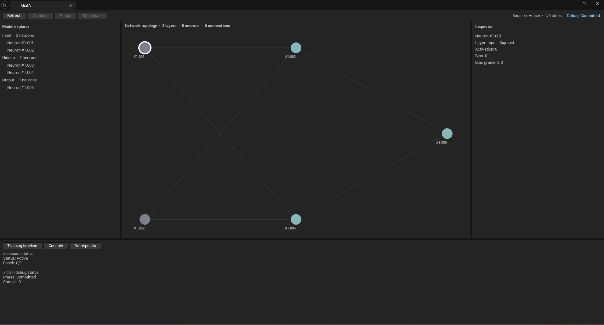
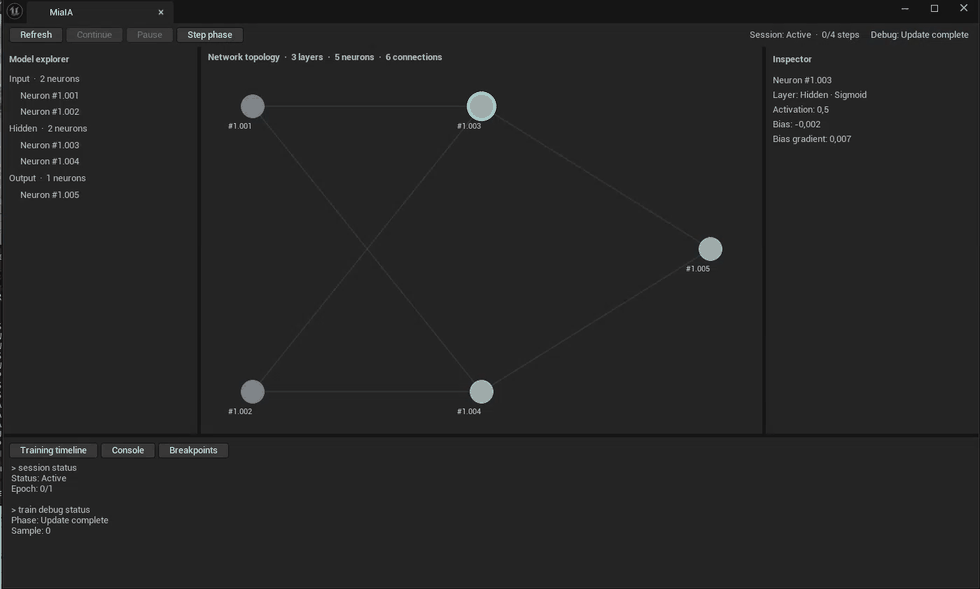

# MiaIA Studio for Unreal

## Current scope

The Unreal project is a client of the same `MiaIAClient` facade used by the Console. The first Blueprint integration exposes a complete vertical slice from model and dataset setup to phase-by-phase inspection. Unreal does not own or duplicate Engine mathematics.

The current integration includes a runtime Blueprint function library, the shared CLI command processor, and one Slate interface hosted both by the custom Unreal editor panel and by the `MiaIAStudio` game target. **MiaIA Studio** is the product name of the graphical IDE, while this project is its Unreal client implementation. The panel is an initial functional shell, not the final visualization or interaction design.

The complete Unreal project lives under `MiaIA/IDE/Unreal`. Future graphical IDE implementations can be added beside it, for example under `MiaIA/IDE/Unity`, without changing Core, Engine, SDK, CLI, or the native Console.

## Blueprint types

The IDE module converts SDK snapshots into Unreal-reflected types:

- `EMiaIATrainingDebugPhase`;
- `EMiaIATrainingSessionStatus`;
- `EMiaIATrainingBreakpointKind`;
- `EMiaIAActivationType`;
- `FMiaIANetworkSnapshot` with reflected layer, neuron, and connection arrays;
- `FMiaIATrainingDebugSnapshot`;
- `FMiaIATrainingSessionSnapshot`;
- `FMiaIATrainingBreakpoint` and `FMiaIATrainingBreakpointHit`;
- `FMiaIATrainingDebugNeuron`;
- `FMiaIATrainingDebugConnection`.

No STL type crosses the Unreal reflection boundary. IDs and indexes use signed 64-bit Blueprint values and are validated before conversion to SDK types. Phase-dependent values include explicit availability flags.

## Blueprint nodes

The `MiaIA` Blueprint categories currently provide:

```text
New Project
Open Project
Save Project
Get Project Info
Import Onnx
Export Onnx
Create Dense Network
Create Configured Dense Network
Get Network Snapshot
Import Csv Dataset
Start Training Session
Get Training Session
Resume Training Session
Pause Training Session
Add Training Breakpoint
Get Training Breakpoints
Set Training Breakpoint Enabled
Remove Training Breakpoint
Clear Training Breakpoints
Get Last Training Breakpoint Hit
Start Session Debug
Advance Debug Phase
Cancel Debug
Get Debug Status
Get Debug Network Snapshot
Get Debug Neuron
Get Debug Connection
Execute Command
```

`Create Dense Network` preserves the original Sigmoid, `0.1` weight, and zero-bias defaults. `Create Configured Dense Network` adds separate hidden and output activation pins plus uniform initial weight and non-input bias pins. The input layer remains raw data and therefore has no activation-selection pin.

The training nodes currently select MSE and SGD internally because those are the only implemented loss and optimizer choices. Future enum pins should be added when the Engine supports more than one valid choice.

The project nodes use the same `.mai` archive implementation as Console and MiaIA Studio. Their reflected information value reports the format version, current path, model and dataset availability, dataset schema, training configuration, and breakpoint count without exposing STL types. The interchange nodes import or export only the supported ONNX model portion.

## Minimal Blueprint workflow

```text
Create Dense Network
    -> Import Csv Dataset
    -> Start Training Session
    -> Start Session Debug
    -> Advance Debug Phase
    -> Get Debug Neuron or Get Debug Connection
```

Call `Advance Debug Phase` repeatedly to move through forward evaluation, backward differentiation, candidate update, verification, and commit. Use `Cancel Debug` before commit to discard the candidate without advancing session progress.

The reflected debug snapshot contains the complete candidate network plus aggregate neuron and connection telemetry. MiaIA Studio therefore refreshes the whole graph with one SDK snapshot instead of issuing one query per visible element. The focused neuron and connection structures remain available for the Inspector: selecting one graph element performs one detailed query for its public value, candidate value, gradient, and update information.

## Demonstration Blueprint

The editor module creates `BP_MiaIADemo` under `Content/MiaIA/Demo` and places one instance named `MiaIA Blueprint Demo` in `MiaIAMain`. Its visible Event Graph uses the public Blueprint nodes to create a small dense network, import the bundled `DemoData/and.csv` dataset, start a controlled training session, inspect one complete debug step phase by phase, and commit it. The CSV remains outside Unreal `Content` so the editor does not try to import it as a Data Table asset.

The previous `NeuronActor` level instance is removed to prevent two demonstrations from mutating the shared client state during the same `BeginPlay`. Its C++ source remains available until the Blueprint replacement has been verified.

The Blueprint asset is generated only after the initial Asset Registry scan and validator registration have completed. Opening `MiaIAMain` is sufficient to install the level instance when it was not the startup map.

## MiaIA Studio editor panel

MiaIA Studio opens automatically and receives focus after Unreal Editor and the Asset Registry finish initializing. Its dock location is managed by the normal Unreal layout system: dock it in the central workspace once and subsequent project launches restore that placement. If the tab is closed, reopen it from `Window > MiaIA Studio`. It reads the same shared `MiaIAClient` state used by the Console and Blueprint nodes; it does not create a separate model or duplicate Engine mathematics. The `Project` toolbar menu creates, opens, saves, and describes `.mai` projects and imports or exports supported ONNX models in both the editor and packaged application. Play in Editor is not started automatically.



The captured foundation panel shows a network created directly from its embedded Console. Contextual command suggestions remain in the narrow left column, while the shared output history, persistent left-side scrollbar, input field, and `Send` action occupy the larger workspace. Suggestions can be accepted by mouse or `Tab`, and previous commands remain available through Up/Down navigation for the lifetime of the open panel.

### Opening and running the demonstration

1. Build the native solution in `Release | x64`, then build `IDEEditor | Win64 | Development`.
2. Open `MiaIA/IDE/Unreal/IDE.uproject` and load the `MiaIAMain` level.
3. Wait for the automatically opened MiaIA Studio tab. If it was manually closed, select `Window > MiaIA Studio` from the main Unreal Editor menu.
4. Dock the MiaIA tab in the central workspace or keep it as a separate window. Unreal restores the saved location on later launches; keeping it separate can make state transitions easier to record or inspect.
5. Start Play in Editor from the main toolbar or press `Alt+P`.
6. Leave the panel controls untouched during the automatic demonstration. `BP_MiaIADemo` creates the network and dataset, starts a session, and advances one debug step automatically at short intervals.
7. Watch the session and debug state in the upper-right corner, the candidate activations in the topology, and the current values in the inspector.
8. Press `Esc` or the main Unreal `Stop` button to end Play in Editor.

To repeat the demonstration, stop Play in Editor completely and start it again. `BeginPlay` recreates the small network and starts a new controlled session. Starting a second phase advance from the panel while the Blueprint automation is running is intentionally discouraged because both actions would control the same shared debug state.



The animation is slowed down for documentation. The demonstration itself advances more quickly so normal editor testing remains responsive.

### Panel layout

- **Two-row toolbar** keeps layout, view, theme, refresh, scalability, help, and application actions on the first row. Training and phase-debug controls occupy a dedicated second row with session and debug status aligned to the right, preserving access when the editor tab or standalone window is narrow.
- **Model explorer** lists layers, neurons, and connections. Selecting an item here also selects it in the topology.
- **Network topology** switches between interactive 2D and 3D renderers for the same current layers, neurons, and weighted connections. Its semantic overlay follows the active debug phase: forward uses candidate activations, backward uses gradient sign and normalized magnitude, update uses parameter-delta sign and normalized magnitude, and verified or committed states return to candidate or committed activations and weights.
- **Inspector** shows neuron activation and bias data or connection weight data, including phase-dependent gradients and candidate updates.
- **Session and debug status** report training progress and the currently inspected phase.
- **Console** is the first and initially selected lower tab. It uses a narrow command-suggestion column on the left and a larger output/input workspace on the right. It accepts the same commands as `Console.exe` and operates on the same process-local state displayed by the panel and used by Blueprint nodes.
- **Training timeline** follows the Console and summarizes the forward, backward, update, verification, and commit sequence.
- **Breakpoints** creates phase, neuron-activation, neuron-gradient, and connection-update conditions through the public SDK facade. Each entry can be enabled, disabled, or removed and reports its hit count; the tab also shows the latest structured trigger.
- **Help** opens the built-in interaction reference or the versioned About dialog in both hosts.

MiaIA Studio requests a lightweight network overview before requesting the complete topology. By default, networks with at most 2,000 neurons and 5,000 connections use detailed mode. Larger networks automatically use compact mode: the topology draws one aggregate node per layer, the explorer lists layer counts instead of every element, and the panel avoids repeatedly copying or painting the complete connection set. The compact header always reports the exact layer, neuron, and connection totals.

Compact mode is a visualization guardrail rather than an Engine limit. The native network remains complete and available through `MiaIAClient`. Element-level visual inspection and phase controls are disabled in compact mode until paged large-model inspection is implemented; use a smaller network when testing the current graphical phase debugger.

### Color theme

Use the `Theme` selector in the panel toolbar to choose `Follow Unreal`, `Dark`, or `Light`. `Follow Unreal` is the default and derives its semantic colors from the active Unreal Slate style. The explicit dark and light palettes remain stable independently of the surrounding editor theme.

The selection is stored in the local Unreal game-user settings configuration and restored by both hosts. It is a per-user preference and does not modify tracked project configuration. The selected palette consistently controls panel surfaces, splitters, buttons, menus, inputs, scrollbars, text, neuron activation, positive and negative weights, selection, and debug-phase emphasis.

### Data refresh, detail limits, and application help

`Data refresh` controls automatic model polling without changing rendering frame rate. `Adaptive` is the recommended default: it polls at 4 Hz while training is running and at 1 Hz while the session is idle or paused. Fixed 1, 2, 4, and 10 Hz choices support slower inspection or more responsive monitoring. The preference is stored in local game-user settings and restored at the next launch. Console commands, toolbar operations, and phase-debug steps bypass the periodic delay and update the interface immediately.

`Detail limits` independently configures the maximum neuron and connection counts accepted by detailed mode. The menu starts at 2,000 neurons and 5,000 connections, applies both values together, and can restore those defaults. Normal ranges are available through sliders; substantially higher finite values can be typed directly, up to 100,000,000 neurons and 1,000,000,000 connections. Applying a value immediately re-evaluates the current network and persists the preference in local game-user settings. Raising the limits can significantly increase snapshot copying, layout, and rendering cost; it does not increase an Engine model limit or disable the compact-mode guardrail.

The `Help` menu contains `Quick help` and `About MiaIA Studio`. Quick help summarizes Console startup, 2D and 3D navigation, multiple selection, layout editing, Inspector use, and phase debugging. About reads `ProjectVersion` from Unreal project configuration and identifies this application as the Unreal frontend over the shared MiaIA Engine, SDK, and CLI services. Both open as themed, scrollable overlays inside the Studio panel, ensuring identical behavior in Unreal Editor and the packaged application without an external platform dialog.

Quick help and About also expose the public MiaIA source location and MPL 2.0 status. About carries the Unreal Engine trademark and copyright attribution. The supported release workflow is `Build/Package-Windows.ps1`: after Unreal finishes the archive, the script copies the repository licensing documents and collected dependency license texts into a readable `Licenses` directory beside the top-level launcher. Packaging directly from Unreal Editor does not perform this post-processing and is not the supported public-distribution path. Unreal-generated runtime notices must remain in the distribution.

### Topology view mode

Use the `View` selector in the toolbar to switch between `2D` and `3D`. Both modes read the same snapshot, selection, Inspector, phase telemetry, semantic colors, and detailed-versus-compact policy. Switching the renderer does not create another network or alter any model value.

The 3D renderer runs inside a real Unreal runtime preview scene and is therefore available in both the editor panel and the packaged application. `StudioCore` supplies normalized two- and three-dimensional positions. Unreal combines them so the initial front camera preserves the familiar 2D reading of layers from left to right and neurons from top to bottom, while layer and neuron depth becomes visible as soon as the camera orbits. Unreal applies only world scale, camera behavior, colors, and drawing.

Detailed 3D rendering keeps every neuron and connection individually identifiable. It does not create one Unreal Actor per element. One aggregated runtime viewport renderer builds shaded neuron spheres and weighted connection cylinders into a single dynamic mesh submission, while MiaIA retains IDs separately for hit testing and Inspector queries. Sphere and cylinder tessellation decrease automatically as the visible graph grows. Stable FXAA smooths geometry edges without the temporal trails produced by history-based antialiasing. Bloom and tonemapping remain disabled, and the embedded viewport uses neutral display gamma, so the shared semantic palette and background follow the same color composition as the 2D Slate canvas instead of becoming emissive, desaturated, or artificially bright. This rendering optimization is distinct from compact mode, which intentionally displays one aggregate sphere per layer for very large networks.

### Panel controls

- `Refresh` immediately reloads all visible snapshots. The panel also refreshes runtime values automatically.
- `Fit view` fits the active renderer: it adjusts 2D zoom and pan or derives a centered front-facing 3D camera from the current topology bounds, viewport size, and aspect ratio while preserving manual neuron positions.
- `Reset layout` discards manual positions and restores the automatic layout and default framing in both 2D and detailed 3D modes.
- `Expand view` collapses Model explorer and the lower tool area so the live topology occupies the available panel while Inspector remains visible on the right. The same button becomes `Restore panels`; expanding or restoring preserves the current renderer, selection, and topology state and automatically refits the new canvas size.
- `Continue` resumes an active paused training session when no phase inspection owns the current step.
- `Pause` requests a safe pause for a running training session.
- `Start debug` attaches a new phase inspection to the next pending training sample. It can start from an idle debug state or after the previous step was committed.
- `Step phase` advances an active debug inspection by exactly one phase.
- `Cancel debug` discards the active candidate before commit and leaves the public network unchanged.
- `Exit` is visible only in the standalone application and requests a clean process shutdown. The Unreal Editor panel continues to use its normal dock-tab close control.

Buttons are enabled only when their operation is valid for the current session and debug state. During the automatic Blueprint demonstration, phase progression is controlled by `BP_MiaIADemo`; the panel buttons are intended for later manual and Console-driven workflows.

### Topology navigation and layout

The 2D topology view supports navigation and layout editing:

- use the mouse wheel to zoom around the pointer;
- drag with the middle mouse button to pan the view;
- click a neuron or connection with the left mouse button to select it;
- use `Ctrl + left click` to add or remove neurons from the selection;
- drag on empty space to select every enclosed neuron, or hold `Ctrl` to add the rectangle to the current selection;
- drag any selected neuron to move the complete selected group while preserving its relative layout;
- select `Fit view` to recover the complete topology after zooming, panning, or moving neurons;
- select `Reset layout` to remove every manual position and restore the original automatic arrangement.

Manual positions use normalized layout coordinates rather than Slate pixel coordinates. They remain stable while the panel is open and can later be reused by another renderer, including a 3D view. They are intentionally not written to ONNX or project configuration. Persistent visualization layouts belong to future MiaIA-specific model metadata.

The 3D topology view uses these controls:

- drag with the right mouse button to orbit around the network;
- drag with the middle mouse button to pan the camera target;
- use the mouse wheel to move closer to or farther from the network across the extended near-to-far camera range;
- click a neuron marker or connection with the left mouse button to select it and update the shared Inspector;
- use `Ctrl + left click` or an optional `Ctrl` selection rectangle to build a multiple-neuron selection;
- drag any selected neuron marker to move the complete selected group on the camera-facing plane while preserving relative positions;
- select `Fit view` to restore the complete front-facing camera framing without discarding manual positions;
- select `Reset layout` to discard manual positions and restore the automatic arrangement and default framing.

The 3D renderer uses solid shaded sphere geometry in a real Unreal scene. It starts with the same front-facing, coplanar topology reading as 2D; orbiting exposes perspective, while camera-relative manual dragging can introduce depth. Detailed views project neuron identifiers back into the Slate overlay, preserving the readable `#id` labels from 2D, and show every selected neuron with an antialiased yellow circular outline without replacing the sphere's activation or debug color. The outline is derived from sampled projection bounds around the real sphere and retains a minimum screen-space radius, so it stays aligned at extreme close zoom and recognizable after zooming far away. Labels are omitted above 500 visible neurons to keep larger scenes legible. Multiple selection and the primary Inspector item persist when switching between 2D and 3D. Dragging changes only the visualization layout held by the open Studio panel: it does not alter topology, weights, activation values, or Engine mathematics.

In compact mode, 2D zoom and pan and 3D camera navigation remain available. `Fit view` and `Reset layout` restore the aggregate layer graph. Individual layer nodes are summaries rather than real neurons and are not draggable in this increment; aggregate-layout editing will be reconsidered with the future layout design.

### Interactive command console

The `Console` tab opens automatically at the bottom of the MiaIA panel. Enter a command in the text box, then press `Enter` or select `Send`. Both actions use the same execution path. The command, its output, and any diagnostic text are appended to the history. The model explorer, topology, inspector, session status, and controls refresh immediately afterward, while keyboard focus returns to the empty command field so the next command can be typed without another click.

The output view automatically scrolls to the newest result after execution. A persistent external vertical scrollbar is positioned on its left edge and remains available for reviewing earlier output. The horizontal splitter between suggestions and the output workspace can be dragged when more room is needed for either side.

The left column displays at most eight contextual suggestions. Each row shows the complete syntax; hovering it shows the short description:

- start typing to filter the current command level;
- press `Tab` to accept the first suggestion;
- click any suggestion to accept that entry;
- press `Up` and `Down` to navigate commands already executed in the current panel session;
- press `Down` past the newest history entry to restore the unfinished text that existed before history navigation.

Completion advances one command level at a time. For example:

```text
tr                  -> train
train s             -> train step | train session
train session r     -> train session run | train session resume
dataset import      -> dataset import csv
```

For a command that is already receiving values, the suggestion becomes a syntax guide without deleting the values already entered. Accepting the guide after typing `create 2` therefore preserves `create 2` and appends a space for the next value.

The editor calls the same reusable command processor as `Console.exe`; it does not start an external executable. This is important because the current SDK state is process-local. A network created with `create` in the panel is immediately visible in the topology, while a separate `Console.exe` process would own a different network.

A minimal editor-driven workflow is:

```text
create 2 2 1 1
predict 1 1
dataset import csv 2 1 DemoData/and.csv
dataset summary
train session start 2 0.01 mse
train session debug
train debug next
train debug status
```

Paths may be absolute or relative to the Unreal project directory. `exit` is reported but deliberately does not close Unreal Editor. Commands currently execute synchronously on the editor UI thread, so long operations such as a large benchmark or a full synchronous training run temporarily block panel interaction. Prefer controlled session steps, phase debugging, or background `train session resume` for interactive work.

### Manual phase inspection

The automatic demonstration commits one step and leaves its four-sample training session active. This provides an immediate entry point for manual inspection:

1. Wait until the demonstration reports `Debug: Committed` and `Session: Active`.
2. Select `Start debug` to attach an inspection to the next pending sample.
3. Select a neuron or connection from the explorer or directly in the topology. A selected connection is drawn thicker in amber.
4. Select `Step phase` once for each transition: forward, backward, candidate update, verification, and commit.
5. Observe the graph overlay change with each phase. Forward displays candidate activation, backward displays positive and negative gradients, update displays positive and negative deltas, and verification returns to the candidate model representation. The legend changes from `weight` to `gradient` or `delta` to identify the current metric.
6. Select a neuron or connection at any phase to keep using focused inspection. The Inspector compares public and candidate values and shows exact gradient, delta, and updated values as soon as they become available; aggregate graph coloring does not replace this element-level query.
7. Before commit, select `Cancel debug` to discard the candidate, or continue stepping to commit it and advance session progress.
8. After commit, select `Start debug` again to inspect the next pending sample.

Neuron color ranges from inactive gray to active green. Positive weights are blue, negative weights are red, and the selected connection is amber. Color intensity and line thickness communicate value strength; exact values remain available in the inspector.

The first panel increment established:

- a layer and neuron explorer;
- a live two-dimensional topology view;
- activation-based neuron coloring;
- positive and negative connection coloring with weight strength;
- neuron and connection selection from either the explorer or topology;
- an inspector for activations, biases, weights, gradients, and candidate updates;
- training-session status and phase timeline;
- working refresh, continue, pause, and debug phase-step actions;
- an interactive command console shared with `Console.exe`.
- safe breakpoint authoring shared with the SDK, CLI, and Blueprint nodes.

The panel refreshes runtime values automatically while rebuilding its explorer and breakpoint list only when their corresponding state changes. Command history is currently memory-only and belongs to the open panel instance. Persistent history, weight editing, asynchronous command dispatch, compact-scene drill-down, and more advanced 3D filtering and analysis remain outside the current implementation.

## Build order

The Unreal module currently links the native Release libraries directly. After changing Core, Engine, or SDK:

1. build the MiaIA native solution in `Release | x64`;
2. confirm `x64/Release/Engine.lib`, `SDK.lib`, `CLI.lib`, and `StudioCore.lib` are current;
3. open or regenerate the Unreal solution from `MiaIA/IDE/Unreal/IDE.uproject`;
4. build `IDEEditor | Win64 | Development`;
5. build `MiaIAStudio | Win64 | Development`;
6. open the project and locate the nodes under the `MiaIA` categories.

## Standalone development host

The `IDEStudio` runtime module owns the reusable panel, topology renderer, theme, and `UMiaIAStudioGameInstance`. The editor-only `IDEEditor` module registers the dockable tab and installs the demonstration Blueprint, but is not part of the game target.

To test the independent host without opening Unreal Editor:

1. build the native solution in `Release | x64`;
2. build the Unreal `MiaIAStudio` target in `Development | Win64`;
3. run `Binaries/Win64/MiaIAStudio.exe` from the Unreal project directory;
4. confirm that the Studio panel covers the game viewport and accepts the same Console commands as the editor panel.

This development executable still reads cooked or editor project content according to the selected Unreal build workflow. Use the packaged application below when testing the complete redistributable directory without Unreal Editor.

## Packaged Windows application

The project packaging settings select the `MiaIAStudio` target, cook `/Game/Maps/MiaIAMain`, use Pak and IoStore containers, and include the supported Windows prerequisites. The editor-only `IDEEditor` module is not part of the game target.

Close Unreal Editor and Visual Studio before the first packaging test, then run from the repository root:

```powershell
Set-Location .\MiaIA\IDE\Unreal
& .\Build\Package-Windows.ps1 -Configuration Development
```

If Windows PowerShell reports that script execution is disabled, run the same script in a one-process bypass. This does not change the machine or user execution policy permanently and does not require an administrator terminal:

```powershell
powershell.exe -NoProfile -ExecutionPolicy Bypass `
    -File .\Build\Package-Windows.ps1 `
    -Configuration Development
```

The default archive is created under:

```text
MiaIA/Artifacts/MiaIAStudio/Windows-Development
```

The script prints the precise path to `MiaIAStudio.exe`. Run that executable with Unreal Editor closed and verify:

1. the application starts directly as MiaIA Studio;
2. it opens in a resizable 1600 x 900 window rather than fullscreen;
3. the model explorer, topology, inspector, theme selector, data-refresh selector, Help menu, Console, and standalone `Exit` action are visible;
4. `create 2 2 1 1` updates the complete interface;
5. `predict 1 1` returns an output;
6. `Quick help` and `About MiaIA Studio` open and close correctly;
7. the `Exit` button, title-bar close action, or `Alt+F4` terminates it without leaving an Unreal process running.

Keep the whole archived directory when copying the application to another machine. `MiaIAStudio.exe` depends on the staged Unreal runtime, cooked content, and container files beside it. Numeric CSV datasets are user data and are intentionally not embedded in this first package; pass an absolute path to `dataset import csv` or copy the dataset into a user-selected external folder.

Public downloads should use a Shipping archive rather than the Development archive. Shipping removes development-oriented behavior, but the final archive must still be reviewed for symbols, logs, diagnostic utilities, unnecessary plugins, and complete third-party notices. Build it with:

```powershell
& .\Build\Package-Windows.ps1 -Configuration Shipping
```

If Unreal Engine is installed elsewhere, pass the installation root explicitly:

```powershell
& .\Build\Package-Windows.ps1 `
    -EngineRoot "E:\Epic Games\UE_5.8" `
    -Configuration Development
```

The packaging script never launches the application and never removes an existing archive. Unreal Automation Tool updates files below the selected output directory. Use `-OutputDirectory` to keep separate experimental packages.

### Microsoft Store package

The repository also contains a manual MSIX workflow for the Microsoft Store. It uses the product identity reserved in Partner Center, declares the desktop full-trust capability and Visual C++ runtime dependency, preserves the collected license material, and launches the real packaged executable instead of the Unreal bootstrap launcher.

Create a fresh Shipping archive first, then run:

```powershell
powershell.exe -NoProfile -ExecutionPolicy Bypass `
    -File .\Build\Package-StoreMsix.ps1 `
    -PackageVersion 1.0.0.0 `
    -SourceDirectory "D:\MiaIA-Releases\Windows-Shipping" `
    -OutputDirectory "D:\MiaIA-Releases\Store-1.0.0.0"
```

The output `.msix` is intentionally unsigned because Microsoft Store validates and signs an accepted submission. Do not distribute that unsigned file directly from the project website. For the precise identity values, version rules, local registration procedure, and Partner Center checklist, see [`Build/Store/README.md`](../../IDE/Unreal/Build/Store/README.md).

### Provisional application branding

The current package uses provisional raster assets derived from the MiaIA Studio brand board:

- `Build/Windows/Application.ico` is the multi-resolution Windows executable icon;
- `Content/Splash/Splash.bmp` is the startup splash staged by Unreal;
- `Build/Brand/MiaIAStudio-AppIcon.png` and `MiaIAStudio-Splash.png` are the normalized PNG masters;
- files ending in `-Source.png` retain the high-resolution generated sources.

The icon uses the cyan, teal, lime, and amber neural-network mark without text. The splash uses the complete `MiaIA Studio` lockup and the exact `VISUALIZE | EXPERIMENT | INSPECT | DEBUG` payoff. These files are intentionally replaceable when final vector or higher-resolution brand assets become available; their Unreal-facing filenames should remain stable.

## Planned Unreal work

- Blueprint coverage for broader Console and SDK operations;
- forward and backward flow animation;
- persistent command history and asynchronous long-running dispatch.
- paged drill-down and filtering for compact large-network summaries;
- persistent layouts through the future MiaIA workspace format;
- automated packaged-application smoke testing.
