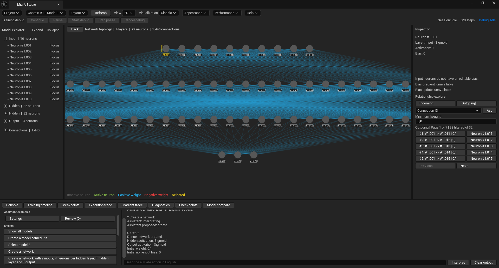
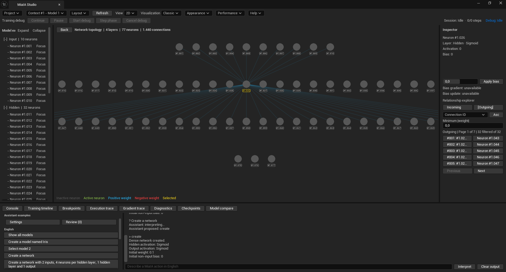
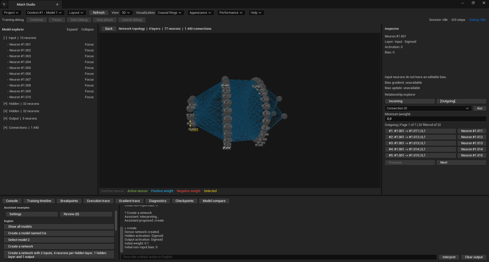
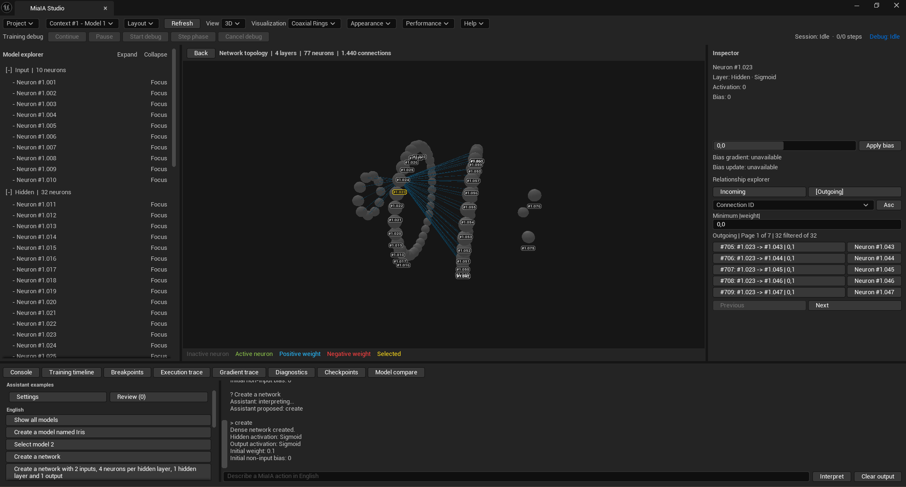
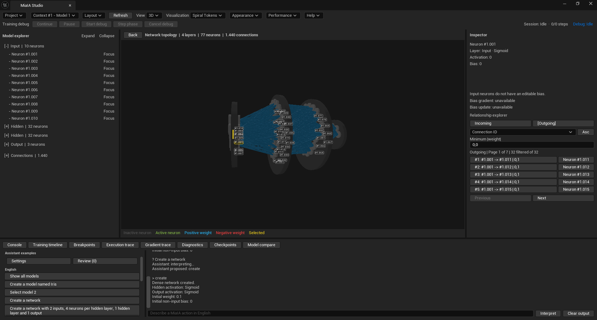
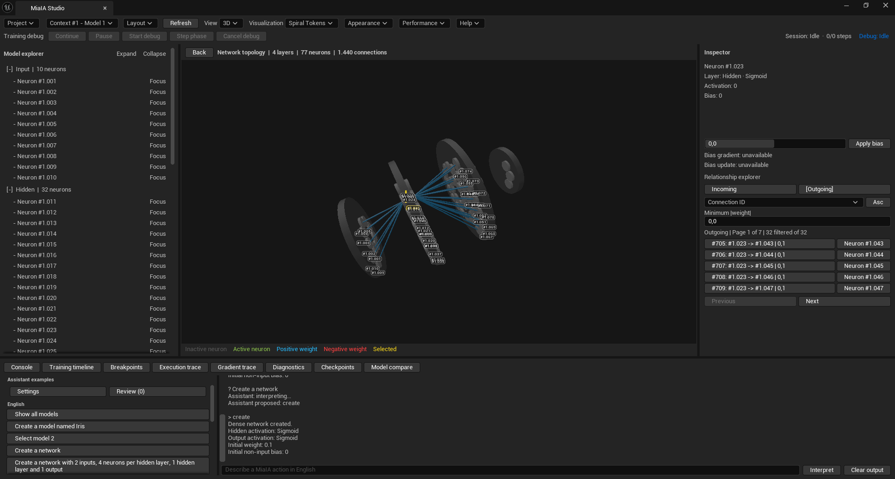
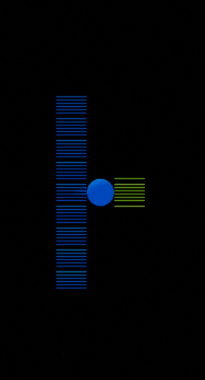
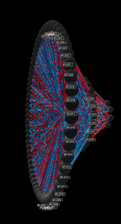
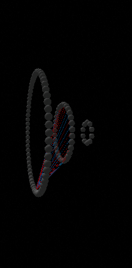

  

<table>
  <tr>
    <td align="center" width="50%">
       
      <strong>Classic 2D</strong> · All connections
    </td>
    <td align="center" width="50%">
       
      <strong>Classic 2D</strong> · Selected neuron connections
    </td>
  </tr>
  <tr>
    <td align="center" width="50%">
       
      <strong>Coaxial Rings 3D</strong> · All connections
    </td>
    <td align="center" width="50%">
       
      <strong>Coaxial Rings 3D</strong> · Selected neuron connections
    </td>
  </tr>
  <tr>
    <td align="center" width="50%">
       
      <strong>Spiral Tokens 3D</strong> · All connections
    </td>
    <td align="center" width="50%">
       
      <strong>Spiral Tokens 3D</strong> · Selected neuron connections
    </td>
  </tr>
</table>

<table>
  <tr>
    <td align="center" width="33%">
       
      <strong>Models</strong>
    </td>
    <td align="center" width="33%">
       
      <strong>Coaxial Rings</strong> · Network detail
    </td>
    <td align="center" width="33%">
       
      <strong>Coaxial Rings</strong> · Selected connections
    </td>
  </tr>
</table>

<em>Explore the whole network, then focus on a single neuron. Click any image to enlarge.</em>

<h1 align="center">MiaIA Studio</h1>

  An interactive development environment for understanding neural networks.

  <strong>VISUALIZE</strong> &nbsp;|&nbsp;
  <strong>EXPERIMENT</strong> &nbsp;|&nbsp;
  <strong>INSPECT</strong> &nbsp;|&nbsp;
  <strong>DEBUG</strong>

  <strong><a href="https://apps.microsoft.com/detail/9nqb4kbwz5pp">Download MiaIA Studio for Windows — Microsoft Store</a></strong>
  &nbsp;&middot;&nbsp;
  <a href="https://www.nonop.biz/miaia">Website</a>
  &nbsp;&middot;&nbsp;
  <a href="MiaIA/Docs/README.md">Documentation</a>
  &nbsp;&middot;&nbsp;
  <a href="MiaIA/Docs/Roadmap/Roadmap.md">Roadmap</a>
  &nbsp;&middot;&nbsp;
  <a href="LICENSE">MPL 2.0</a>

## Understand the network, not just the output

MiaIA makes neural networks observable. Build or import a model, execute it, inspect activations and gradients, follow parameter updates, and advance training one mathematical phase at a time.

The MiaIA Studio **0.1 Alpha** release includes:

- a C++20 neural-network Engine and public SDK;
- direct inference, evaluation, observable backpropagation, and atomic SGD training;
- controlled foreground and background sessions with navigable history;
- phase-by-phase training debug with candidate-state inspection and rollback;
- immutable forward and backward gradient-flow traces with graphical playback;
- multi-model projects built from isolated model contexts, including clean experiment forks with copied networks, datasets, training configurations, and breakpoints;
- immutable comparison of two model contexts with topology compatibility, ranked parameter deltas, and 2D/3D visual overlays;
- model checkpoints with inspection, comparison, transactional restore, and `.mai` persistence;
- bounded neuron and connection relationship inspection with exact topology counts;
- ONNX model interchange and numeric CSV datasets;
- one shared command processor for the terminal and Unreal clients;
- interactive 2D and 3D topology views in MiaIA Studio;
- a renderer-neutral StudioCore application layer and Windows standalone host.

> **Project status — 0.1 Alpha:** the mathematical and application foundations, versioned `.mai` v2 multi-context persistence with v1 migration, execution traces, diagnostics, and model checkpoints are implemented and tested. Persisting session history and visualization layouts remains planned work. APIs and supported file-format behavior may evolve during the alpha series.

## Alpha limitations

- The native engine currently focuses on observable feed-forward networks and the activations documented by the project.
- ONNX import and export support the documented dense subset, not arbitrary ONNX graphs or operators.
- Built-in optimization currently focuses on mean squared error and stochastic gradient descent.
- `.mai` version 3 persists deterministic sample-order configuration but not transient training progress, session history, annotations, or visualization layout; versions 1 and 2 remain readable.
- Live model, dataset, training, and checkpoint state is process-local; separate executables do not share one running session.
- The packaged application is currently verified for Windows x64. Other platforms and solution configurations are not release targets yet.
- Alpha APIs and workflows can change; preserve important interoperable models through ONNX exports where supported.

Download the Windows app directly from the [Microsoft Store](https://apps.microsoft.com/detail/9nqb4kbwz5pp). Visit [www.nonop.biz/miaia](https://www.nonop.biz/miaia) for official project information. The corresponding source code is maintained in this repository.

## Documentation

- [Documentation overview](MiaIA/Docs/README.md)
- [Architecture](MiaIA/Docs/Architecture/Architecture.md)
- [History](MiaIA/Docs/History/History.md)
- [Roadmap](MiaIA/Docs/Roadmap/Roadmap.md)
- [MiaIA Studio](MiaIA/Docs/Studio/Studio.md)

## License

Original MiaIA source code is available under the [Mozilla Public License 2.0](LICENSE). Third-party components, Unreal Engine, and MiaIA branding remain subject to their respective terms. See [Licensing](LICENSING.md), [third-party notices](THIRD_PARTY_NOTICES.md), and [trademark policy](TRADEMARKS.md).

Copyright 2026 Agostino Mosillo.

The repository is currently author-led and does not accept unsolicited code contributions. Bug reports and focused feedback are welcome as described in [CONTRIBUTING.md](CONTRIBUTING.md).
