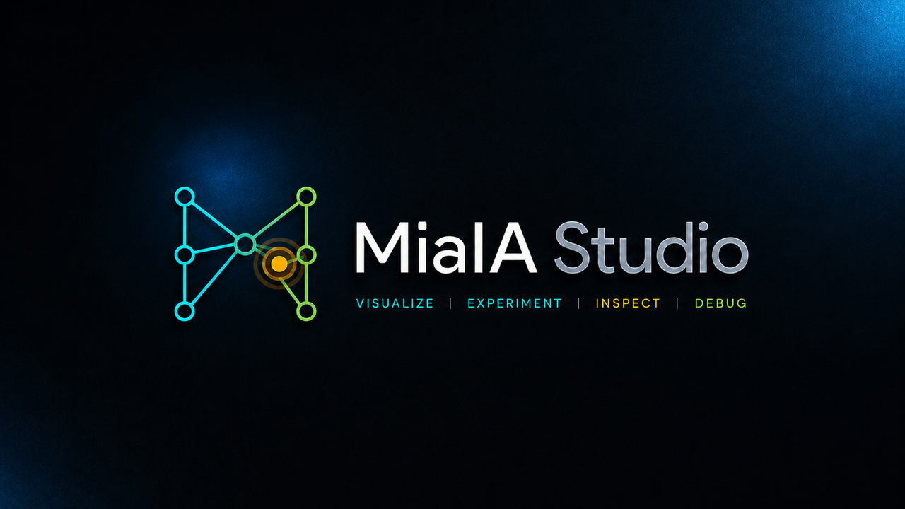

  

<h1 align="center">MiaIA Studio</h1>

  An interactive development environment for understanding neural networks.

  <strong>VISUALIZE</strong> &nbsp;|&nbsp;
  <strong>EXPERIMENT</strong> &nbsp;|&nbsp;
  <strong>INSPECT</strong> &nbsp;|&nbsp;
  <strong>DEBUG</strong>

  <a href="https://www.nonop.biz">Website &amp; Downloads</a>
  &nbsp;&middot;&nbsp;
  <a href="MiaIA/Docs/README.md">Documentation</a>
  &nbsp;&middot;&nbsp;
  <a href="MiaIA/Docs/Roadmap/Roadmap.md">Roadmap</a>
  &nbsp;&middot;&nbsp;
  <a href="LICENSE">MPL 2.0</a>

## Understand the network, not just the output

MiaIA makes neural networks observable. Build or import a model, execute it, inspect activations and gradients, follow parameter updates, and advance training one mathematical phase at a time.

The current early-alpha foundation includes:

- a C++20 neural-network Engine and public SDK;
- direct inference, evaluation, observable backpropagation, and atomic SGD training;
- controlled foreground and background sessions with navigable history;
- phase-by-phase training debug with candidate-state inspection and rollback;
- ONNX model interchange and numeric CSV datasets;
- one shared command processor for the terminal and Unreal clients;
- interactive 2D and 3D topology views in MiaIA Studio;
- a renderer-neutral StudioCore application layer and Windows standalone host.

> **Project status:** the mathematical and application foundations are implemented and tested. Persistent `.mia` workspaces and the complete production debugging experience remain planned work. APIs and file formats may change during early development.

Official releases are published at [www.nonop.biz](https://www.nonop.biz). The corresponding source code is maintained in this repository.

## Documentation

- [Documentation overview](MiaIA/Docs/README.md)
- [Architecture](MiaIA/Docs/Architecture/Architecture.md)
- [History](MiaIA/Docs/History/History.md)
- [Roadmap](MiaIA/Docs/Roadmap/Roadmap.md)
- [MiaIA Studio](MiaIA/Docs/Studio/Studio.md)

## License

Original MiaIA source code is available under the [Mozilla Public License 2.0](LICENSE). Third-party components, Unreal Engine, and MiaIA branding remain subject to their respective terms. See [Licensing](LICENSING.md), [third-party notices](THIRD_PARTY_NOTICES.md), and [trademark policy](TRADEMARKS.md).

Copyright 2026 Agostino Mosillo.

The repository is currently author-led and does not accept unsolicited code contributions. Bug reports and focused feedback are welcome as described in [CONTRIBUTING.md](CONTRIBUTING.md).
